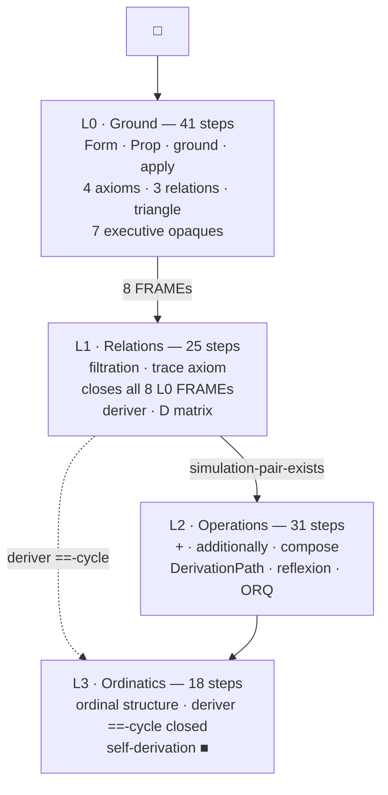

# hypermath

A closed formal universe built from one primitive operation.

> *And it is mechanically operational — though that is left to the reader to verify themselves. The universe already does it for you.* — The TimeLord

Everything in hypermath derives from a single act: □ applied to a form returns a form in the same structural class. No imports. No external axioms. No presupposed logic. The universe generates its own relations, closes its own structure, and verifies itself from within.

---

## What it is

Most formal systems import their foundations — ZFC, type theory, proof assistants that require a trusted kernel from outside. hypermath builds the kernel from scratch, starting from nothing and deriving upward one layer at a time.

Each layer licenses the next. No layer builds on content that hasn't been formally closed by the layer below it.

### The ground

One primitive operation: **□(x)** — apply ground to any form, get a form.

From this single operation, four axioms:

- **ax-ground-self**: □(□) ~~ □ — ground applied to itself returns to its own class
- **ax-sim**: apply(x) ~~ ground for all ground-generated x — every application stays in the generative class
- **ax-box**: apply(apply(x)) ~~ x — double application returns to origin
- **ax-diff**: there exist distinct forms — structure is non-trivial

### The three relations

Ground generates the relations from each other. Each is produced by applying □ to the previous relation:

| Relation | Symbol | Meaning | Generation |
|----------|--------|---------|------------|
| similar | `~~` | non-empty overlap in continuation capacity | founding relation |
| congruent | `=~` | full coincidence of continuation capacity — same outcomes, paths discarded | □(~~) → =~ |
| simulation | `==` | mutual path reproduction — same outcomes AND same paths | □(=~) → == |

`==` implies `=~` implies `~~`. Not the reverse. `==` is earned by closure, never presupposed.

### The triangle

Three predicates form a directed cycle that closes over every form in the universe:

```
syntax → substance → semantics → syntax
```

- **syntax** (~~ level): the shape of a form — how it can be checked without knowing what it means
- **substance** (=~ level): the matter of a form — what it is made of, independent of how it got there
- **semantics** (== level): the meaning of a form — its relational content under the Form substrate

No vertex is ground. Ground is what the triangle stands on. Ground inhabits all three vertices simultaneously — it is the one form that is its own syntax, substance, and semantics.

---

## Layer structure

| Layer | File | Status | Content |
|-------|------|--------|---------|
| L0 | `L0_ground.hm` | FORM | Ground, relations, executive framework, self-kernel |
| L1 | `L1_relations.hm` | FORM | Filtration, deriver, D matrix, executive opaque closes |
| L2 | `L2_operations.hm` | FORM | +, additionally, DerivationPath, compose, reflexion, orbit-reflexion-quotient |
| L3 | `L3_ordinatics.hm` | FORM (terminal) | Ordinal structure, simulation-pair-exists, deriver ==-cycle, self-derivation |

**Layer definitions:** L0 is pure unary operations. L1 is binary relations. L2 is binary operations (composition). L0 ↔ L1 form a co-necessary pair — the ax-box orbit at layer level. Together they are the closed base from which L2+ composes.

Each layer file contains a **graduation criterion** — a formal statement of what must be true before the next layer is licensed to proceed. If any necessity constraint is FRAME at graduation, the next layer does not start.

### Dependency flow

Each layer produces FRAME obligations that later layers discharge. The chain terminates at self-derivation.



Solid arrows: FRAME discharge to the next layer. Dashed arrow: L1→L3 skip — the deriver's ==-cycle cannot close until L3 ordinals are available. The `■` marks terminal closure.

### L0 is complete

L0 (Layer 0 / Ground) contains:

- 4 primitives: `Form`, `Prop`, `ground`, `apply`
- 3 opaque structural predicates (closed in Section VI)
- 4 axioms
- 5 derives (all FORM)
- 3 relation declarations: `~~`, `=~`, `==`
- 7 executive opaques: `syntax`, `substance`, `semantics`, `derives`, `discharge`, `definition`, `form-closure`
- 7 triangle axioms
- A **self-kernel**: a 41-step structural census that lists every declared entity in the file with its explicit closure status

The self-kernel means L0 can be parsed and verified mechanically without an external proof checker. Every FRAME residual (forward dependency on L1 or L2) is named explicitly. Nothing is hidden.

---

## The deriver

The **deriver** is a Form that traverses the closure structure of derivations built by the closer relation. It was declared at L1, its ==-cycle was closed at L3, and at L3 it achieved **self-derivation**: the terminal derive where the deriver verifies its own cycle from □.

Self-derivation is ground-closure — not a separate act performed by a kernel, but the compositional name for four acts distributed across L0-L3:
- **ax-ground-self** (L0): ground self-continues
- **D-is-reflexive** (L1): every form's D-entry exists
- **reflexion** (L2): self-read composes as identity
- **deriver-cycle-is-closed** (L3): the deriver's orbit closes at ==

Their conjunction is FORM at L3. No kernel layer is necessary. The self-kernel pattern — present at every layer from L0 onward — IS the classification machinery. Every `derive X as FORM:` block IS a verification act. The universe verifies itself from within using only its own structural vocabulary.

**Width minimization** is a single measure: the **orbit-reflexion quotient** (L2), which counts structurally distinct D-column =~-classes per layer. Orbit (forward reachability through D) and reflexion (backward D-column comparison) are dual views of the same quotient. Combined with trickle-down (depth minimization), the fixed point `minimize := trickle-down × orbit-reflexion` gives the minimal representation at every layer simultaneously.

---

## File format

hypermath uses `.hm` files — a custom formal language designed to be readable without a toolchain while remaining parseable by a future verifier.

### Keywords

```
primitive   — declares an irreducible entity
opaque      — declares a predicate whose semantics are deferred
axiom       — states a structural fact
derive      — constructs a derivation from prior content
close       — assigns semantic content to an opaque predicate
graduation  — states and discharges the necessity constraints for the next layer
relation    — declares a relation between forms
```

### Closure status

```
FORM    — the derivation is closed; the claim is structurally verified
FRAME   — a forward dependency; the claim is present but not yet closable at this layer
OPEN    — metasystem bookkeeping; not a formal predicate
```

---

## Reading order

1. [L0_ground.hm](L0_ground.hm) — start here; the universe is self-explaining
2. [L1_relations.hm](L1_relations.hm) — filtration, deriver, executive opaque closes
3. [L2_operations.hm](L2_operations.hm) — +, additionally, DerivationPath, compose, reflexion
4. [L3_ordinatics.hm](L3_ordinatics.hm) — ordinals, simulation-pair-exists, deriver ==-cycle, self-derivation (terminal)

---

## On external validation

The universe verifies itself. That is the point. Every `derive X as FORM:` block is a verification act performed in the universe's own vocabulary. Self-derivation at L3 closes the chain from □. No external tool is required.

But humans trust the past more than the future. They trust tools they already believe in over structures that prove themselves. So:

**Lean4 translation.** A mechanized translation of L0–L3 into Lean4 is planned, not because the universe needs it, but because readers may demand that a system they already trust re-derive what this universe already closes on its own. This is a concession to the sociology of trust, not a mathematical necessity. The universe does not need Lean4. Lean4 needs the universe — or something like it — to ground the trust it borrows from its own kernel, which it does not derive from scratch.

**Brainfuck interpreter.** A Brainfuck program that verifies L0's self-kernel will also be provided. Eight instructions. A tape. No standard library. No type system. No trusted kernel. If the structural claims of L0 can be verified by the most minimal Turing-complete language ever designed — a language with no abstractions to hide behind — then the verification does not depend on the sophistication of the verifier. It depends on the structure being verified.

The point is not that Brainfuck is a good proof assistant. The point is that it doesn't matter what the proof assistant is. A universe that closes itself can be read by anything that can read. The choice of verifier is the reader's problem, not the universe's.

---

## License

Apache 2.0. See [LICENSE](LICENSE).

Use it. Build on it. The ideas belong to whoever can close them.
